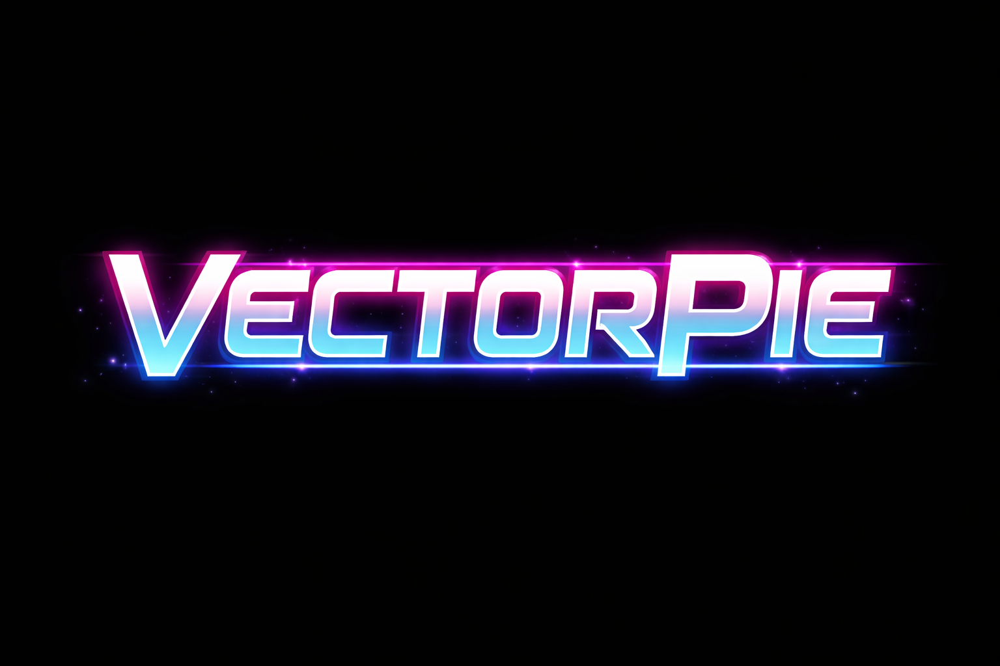

# VectorPie User Manual



## Overview

VectorPie is a pre-configured Raspberry Pi image designed to be used with the USB-DVG vector generator board. It can also be used without USB-DVG, displaying on a standard HDMI monitor instead. It boots directly into the game menu and all navigation is done entirely through your arcade controls — no keyboard, mouse, or desktop environment required.

Key features:

- **Headless operation** — runs at boot with no monitor or desktop required on the Pi
- **HDMI-0 marquee display** — the primary HDMI output automatically shows the marquee artwork for the game currently highlighted in the menu
- **USB-DVG support** — drive a real vector monitor via the USB-DVG vector generator board; HDMI output is also supported for use without USB-DVG
- **Unified input mapping** — controls are configured once in AdvanceMAME and apply to the menu and every game, including non-emulated titles
- **Wi-Fi configuration** — connect to a wireless network directly from the menu
- **Remote access** — built-in SSH server and Windows network share for easy file management from a PC

VectorPie is compatible with the **Raspberry Pi 4** and **Raspberry Pi 5**.

---

## Supported Hardware

- Raspberry Pi 4 (4 GB or 8 GB) or Raspberry Pi 5 (4 GB or 8 GB)
- 32 GB SD card or larger

---

## Download & Installation

### VectorPie Image

1. Download the VectorPie image (approximately 2 GB): [VectorPie Image](https://drive.google.com/file/d/1MdsFRoc89O2H9Lby5UuK2zCzRp6U9Z3U/view?usp=sharing)
2. Write the image to a 32 GB or larger micro SD card using **balenaEtcher** ([download](https://etcher.balena.io/)):
   - Open balenaEtcher and click **Flash from file**, then select the downloaded `.img.gz` file
   - Click **Select target** and choose your micro SD card
   - Click **Flash!** and wait for the write and verification to complete
3. Insert the micro SD card into the Raspberry Pi and power it on — VectorPie boots directly into the game menu

### USB-DVG Firmware

There are two USB-DVG firmware variants:

- **Standalone** — standard firmware for use with any cabinet or custom control setup
- **Arcade Control** — includes support for an adapter card that connects directly to the original wiring harness of an Asteroids, Asteroids Deluxe, Space Duel, Tempest, or Black Widow cabinet, allowing the cab's original buttons, CRT, and coin inputs to be used natively

**Which firmware should I use?**

| USB-DVG Version | Use |
|---|---|
| v1 / v2 | Standalone only |
| v3 or later (standalone) | Standalone |
| v3 or later (mounted on adapter card) | Arcade Control |

Flash the firmware that matches your hardware using **Teensy Loader** ([download](https://www.pjrc.com/teensy/loader.html)):

> **Note:** Skip this section if your USB-DVG board already has firmware version 1.14R0 or later installed.

1. Download the appropriate USB-DVG firmware `.hex` file:
   - [Standalone Firmware 1.14R0](https://drive.google.com/file/d/1IO9XF388TRg90m8kquqngAY8srt2M2BB/view?usp=sharing)
   - [Arcade Control Firmware 1.14R0](https://drive.google.com/file/d/1j4ugqPxryaka84zsrSmOzZL85EJ35Jrd/view?usp=sharing)
2. Open **Teensy Loader** and load the `.hex` file via **File → Open HEX File**
3. Press the reset button on the Teensy board — Teensy Loader will detect the board and automatically flash the firmware
4. Once flashing is complete the board resets and is ready to use

---

## Accessing the Pi from a Windows PC

VectorPie includes a pre-configured SSH server and Samba network share, so you can manage files and settings from any Windows PC on the same network without needing a keyboard or monitor connected to the Pi.

To find the Pi's IP address, press **Tab** from the main menu to open Settings and navigate to **NETWORK** — the current IP address is displayed there.

The default login credentials for both the network share and SSH are:

| | |
|---|---|
| **Username** | `pi` |
| **Password** | `raspberry` |

### Network Share (File Access)

The Pi's files are accessible as a standard Windows network share named **pi**. To connect:

1. Open **File Explorer** on your Windows PC
2. In the address bar, type `\\<pi-ip-address>\pi` and press Enter (e.g. `\\192.168.1.50\pi`)
3. Log in with username `pi` and password `raspberry` when prompted
4. Use the share to add ROMs, replace artwork, or edit the game list

You can also map it as a persistent network drive:
1. Right-click **This PC** in File Explorer and choose **Map network drive**
2. Enter `\\<pi-ip-address>\pi` as the folder path and check **Reconnect at sign-in**

### SSH (Command Line Access)

SSH lets you open a terminal on the Pi from your Windows PC. Windows 10 and 11 include a built-in SSH client.

1. Find the Pi's IP address on the VectorPie **Settings → Network** page
2. Open **Command Prompt** or **PowerShell** on your PC
3. Type: `ssh pi@<pi-ip-address>` and press Enter
4. Enter the password `raspberry` when prompted

Alternatively, use a free SSH client such as **PuTTY** if you prefer a dedicated application.

---

## Menu Navigation

All navigation can be done with either a keyboard or arcade controls. Mappings are read from the AdvanceMAME configuration. Available controls are shown as hints along the bottom of the menu screen at all times.

> **Note:** A keyboard may be needed initially to configure the button mappings for your arcade controls inside AdvanceMAME. Once mapped, the keyboard is no longer required.

| Action | Description |
|---|---|
| Up / Down | Move between games in the current manufacturer's list |
| Left / Right (on manufacturer header) | Switch to the previous or next manufacturer |
| Left / Right (on a game) | Cycle through ROM variants (revisions, regions, prototypes) |
| Select / Start | Launch the selected game |
| Settings (Tab) | Cycle through settings and network pages |
| Quit / Coin button | Exit the menu (press twice to confirm) |
| Calibration button | Enter USB-DVG calibration mode (USB-DVG only) |

---

## Menu Layout

The menu shows a vertically scrolling list of games grouped by manufacturer:

- The **manufacturer header** is the top-level entry for each manufacturer. Pressing Left/Right while it is selected switches manufacturers.
- **Game entries** are listed below the header. Games with multiple ROM variants show left/right arrows and can be cycled with Left/Right.
- The **selected item** is displayed full-size in the center with a pulsing highlight. Surrounding entries scale down toward the edges.
- Long game names scroll horizontally within the selection box.

---

## HDMI-0 Marquee Display

The primary HDMI output (HDMI-0) automatically updates to show the marquee artwork for the currently highlighted game. Browsing at the manufacturer level shows the manufacturer's logo. If no artwork exists for a specific game a default image is shown.

The artwork scaling mode (Fit, Stretch, or Zoom) can be changed in the Settings menu.

---

## HDMI-1 Overlay Display

VectorPie supports a second display on HDMI-1 configured to show overlay artwork alongside the vector CRT, so both are visible to the player simultaneously. The overlay image is driven by the Pi's second HDMI output and displays game-specific artwork that complements the vector display — replicating the color overlays used in the original arcade cabinets.

When a game is launched, VectorPie automatically loads the matching overlay image onto the second display. The image remains static for the duration of the session. When the game exits the overlay window is closed.

Overlay lookup follows this order:

1. The clone ROM name is tried first (e.g. `asteroid.png` for the `asteroid` ROM)
2. If not found, the parent ROM name is tried
3. If neither is found, no overlay is shown and the second display is left blank

The image is scaled to fit the display's resolution while preserving aspect ratio (letterboxed or pillarboxed as needed).

---

## Input Mapping

Control mappings are configured **once inside AdvanceMAME** and apply automatically everywhere:

- The VectorPie menu navigation controls
- All AdvanceMAME games
- Games compiled natively for the Pi — these use SDL and read their input mappings directly from the same AdvanceMAME configuration file

To remap controls, launch any AdvanceMAME game and use its input configuration menu. The new mappings take effect in the menu and all games immediately on the next launch.

The menu reads the following AdvanceMAME input actions:

| AdvanceMAME Action | Menu Function | Default Key |
|---|---|---|
| `ui_up` | Navigate up | Up Arrow |
| `ui_down` | Navigate down | Down Arrow |
| `ui_left` | Navigate left / previous manufacturer | Left Arrow |
| `ui_right` | Navigate right / next manufacturer | Right Arrow |
| `ui_select` | Launch selected game | 1, Enter, or Left Ctrl |
| `ui_configure` | Open settings menu | Tab |
| `ui_cancel` | Quit / exit | Escape |

The calibration mode key (`5`) is fixed and cannot be remapped.

### Game Controls

VectorPie games use several types of analog and digital controls. AdvanceMAME automatically maps connected hardware to the appropriate control type for each game.

| Control Type | AdvanceMAME Action | Typical Input |
|---|---|---|
| Directional movement | `p1_up/down/left/right` | Joystick, keyboard arrows |
| Analog stick | `p1_stickx`, `p1_sticky` | Analog joystick |
| Rotary spinner | `p1_dialx` | Spinner, mouse X axis |
| Trackball | `p1_trackballx`, `p1_trackbally` | Trackball, mouse |
| Mouse pointer | `p1_mousex`, `p1_mousey` | Mouse |
| Fire / action | `p1_button1` | Left Ctrl, mouse button, joystick button |
| Player 1 start | `start1` | 1 key |
| Player 2 start | `start2` | 2 key |
| Insert coin | `coin1` | 5 key |

Two-player games that use twin sticks use both `p1_` and `p2_` actions for movement and aiming independently.

> **Note:** A mouse and an analog joystick can be used simultaneously. For games that use an analog stick (Star Wars, Empire Strikes Back, Lunar Lander, Tail Gunner, Red Baron), the **ADSTICK DEVICE** setting in the Settings menu selects which device drives the control — JOYSTICK or MOUSE. Spinners and trackballs are not affected by this setting.

---

## Wi-Fi Configuration

Wi-Fi is configured directly from the menu — no keyboard or SSH session required.

1. Press **Tab** twice to reach the network page (game menu → settings → network) — the Wi-Fi scan may take up to 15 seconds to complete the first time
2. Use Left/Right on **WIFI NETWORK** to select your network from the scan results
3. Navigate to **PASSWORD** and enter your password (Left/Right cycles characters, Up/Down moves the cursor)
4. Navigate to **CONNECT** and press Select

The current connection status and IP address are shown at the top of the network page.

---

## Idle Dimming & Screensaver

| Timeout | Behavior |
|---|---|
| 5 seconds idle | Menu text fades; marquee image brightens |
| 10 seconds idle | Text fully invisible; marquee fully visible |
| 30 seconds idle | Screensaver activates; VectorPie logo displayed as marquee |

On the USB-DVG the screensaver shows drifting asteroids and a bouncing VectorPie logo. Any control input returns to the menu.

---

## Settings Menu

Press **Tab** to cycle through the settings and network pages (game menu → settings → network → game menu). Press **Escape** from any page to return directly to the game menu. Navigate with Up/Down; adjust values with Left/Right; press Select to toggle or activate.

| Setting | Description |
|---|---|
| MARQUEE DISPLAY | Artwork scaling mode: FIT / STRETCH / ZOOM |
| ENABLE DVG | Enable/disable USB-DVG output |
| OVERLAY | Controls line artwork and color overlays on supported games (see below). Options: DISABLED / COLORING / ARTWORK / BOTH |
| AUTO START GAME | Auto-launch the USB-DVG default game on startup |
| AUDIO OUTPUT | Read-only display of the audio output device currently selected by the system |
| MASTER VOLUME | System-wide volume (0–100%) |
| SOUND ENABLED | Enable/disable all menu audio |
| SOUND VOLUME | Navigation/select effects volume |
| MUSIC VOLUME | Background music volume |
| ZERO DEADZONE | Removes the joystick axis deadzone at the kernel level for maximum precision. Required for certain analog controllers such as the Alan-1 Star Wars yoke. |
| ADSTICK DEVICE | Selects which device drives analog stick controls (Star Wars yoke, etc.): JOYSTICK (default) or MOUSE. See Input Mapping for details. |

Changes are saved automatically when closing the settings menu.

---

## USB-DVG Support

VectorPie can drive a USB-DVG vector generator board to render the menu on a real vector monitor alongside the HDMI-0 marquee display.

The USB-DVG renders the full game menu as vector text, shows manufacturer logos, and runs a drifting asteroids screensaver when idle. It can also query the hardware for a default game to auto-launch on startup.

The USB-DVG is detected automatically when connected and can be enabled or disabled from the Settings menu.

> **Note:** USB-DVG firmware version 1.14R0 or later is required.

### Connecting the USB-DVG

Plug the USB-DVG into one of the **USB 3.0 ports** (the blue connectors) on the Raspberry Pi. Leave the other USB 3.0 port unconnected.

On the **Raspberry Pi 5**, if you are using a USB audio device, connect it to one of the **USB 2.0 ports** (the black connectors) rather than a USB 3.0 port.

Joysticks, keyboards, mice, and zero delay encoders should be connected to the remaining USB 2.0 port, or through a USB hub plugged into it if multiple devices are needed.

### Color Overlays

Many classic black & white vector arcade games originally shipped with a physical plastic color overlay placed directly on the monitor glass to give the illusion of color. VectorPie simulates these overlays digitally by tinting the vectors sent to the USB-DVG, so the games appear on screen with colors faithful to the original arcade experience.

Color overlays are supported for the following games:

| Game | Overlay |
|---|---|
| Armor Attack | Yellow outer border, green play field |
| Asteroids Deluxe | Blue |
| Barrier | Blue |
| Battle Zone | Green play field, red radar screen |
| Bradley Trainer | Green |
| Demon | Zone-based multi-color |
| Meteorites | Yellow |
| Omega Race | Amber/gold |
| Red Baron | Cyan |
| Solar Quest | Red at top, yellow in center, blue elsewhere |
| Star Castle | Concentric rings — blue outer, red, orange, yellow inner |
| Star Hawk | Blue at low intensity, white at high intensity |
| Sundance | Yellow |
| Tail Gunner | Cyan |
| Warrior | Color tinted |

Games that natively output color vectors (Tempest, Major Havoc, Star Wars, Gravitar, Black Widow, Space Duel, Quantum, and all Sega and Cinematronics color titles) are rendered in their original colors and do not use overlays.

Overlays are controlled from **Settings → OVERLAY** with four options: DISABLED (all games render in white), COLORING (color tinting only), ARTWORK (line artwork only), or BOTH (default — full overlay with coloring and line artwork).

### Calibration Mode

Vector monitors may require geometric adjustment to correctly display the image. VectorPie includes a built-in calibration mode that outputs test patterns via the USB-DVG to help align and tune the monitor.

To enter calibration mode, press the Calibration button while the USB-DVG is enabled. Use Left/Right to cycle through the available patterns and press Quit to exit.

| Pattern | Description |
|---|---|
| DIAGONAL BOXES | Crossing diagonal lines across the full screen — useful for checking linearity and geometry |
| CONCENTRIC BOXES | Nested rectangular frames centered on the screen — useful for checking centering and aspect ratio |
| GRID | Evenly spaced horizontal and vertical lines — useful for checking overall linearity and convergence |
| COLOR INTENSITY BARS | Graduated brightness bars in each color channel — useful for checking beam intensity and color balance |

The current pattern name is shown on the HDMI-0 marquee display during calibration.

---

## Launching Games

Pressing Select on a game stops the theme music, suspends the display, and launches the game. After the game exits the menu resumes automatically. Any control mappings or settings changed inside AdvanceMAME take effect immediately.

---

## Game List — `gamelist.ini`

The game list is a pipe-delimited text file located at `/usr/local/share/advance/gamelist.ini`. Each line defines one game:

```
MANUFACTURER|DISPLAY NAME|PARENT ROM|CLONE ROM[|COMMAND]
```

| Field | Description |
|---|---|
| MANUFACTURER | Groups games by manufacturer (e.g. `Atari`, `Sega`) |
| DISPLAY NAME | The name shown in the menu |
| PARENT ROM | The AdvanceMAME parent ROM name |
| CLONE ROM | The specific ROM variant to launch |
| COMMAND | (Optional) Custom launcher for non-emulated games |

Example:
```
Atari|Asteroids (rev 2)|asteroid|asteroid
Atari|Tempest (rev 3)|tempest|tempest
Sega|Star Trek|startrek|startrek
```

Games sharing the same parent ROM are grouped as variants and cycled with Left/Right in the menu.

---

## Artwork, ROMs and Samples

| File type | Location |
|---|---|
| ROMs | `/usr/local/share/advance/rom` |
| Samples | `/usr/local/share/advance/sample` |
| Marquee artwork | `/usr/local/share/advance/artwork/marquees` |
| Overlay artwork | `/usr/local/share/advance/artwork/overlays` |

Artwork images are PNGs. The filename must match the clone ROM name (e.g. `asteroid.png`). If no match is found, the parent ROM name is tried. For marquees, `default.png` is used as a final fallback if neither is found.

Manufacturer logos follow the naming pattern `mfg_<name>.png` (lowercase, spaces as underscores), e.g. `mfg_atari.png`. These are stored in the `artwork/marquees` directory.

---

## Troubleshooting

**ENABLE DVG, OVERLAY, and AUTO START GAME are grayed out in Settings**

These options are unavailable because the USB-DVG board is not being detected. Check that the USB-DVG is securely connected to a USB port on the Pi and try again. Once detected, the options will become active.

---

**Using a mouse yoke with an analog joystick also connected (Star Wars, ESB, Lunar Lander)**

Games that use an analog stick control (Star Wars yoke, Lunar Lander thruster) default to using the analog joystick. To use a mouse or yoke controller instead, change **ADSTICK DEVICE** to **MOUSE** in the Settings menu. This makes the mouse exclusively drive those controls and the analog joystick will have no effect on them. Spinners, trackballs, and all other controls are unaffected by this setting.

---

**Raspberry Pi intermittently shows Network Install screen instead of booting**

On Raspberry Pi OS Trixie Lite, the Pi 4 or Pi 5 may intermittently display the red/white Network Install recovery screen at power-on instead of booting from the SD card or USB device. This happens even when a valid boot device is present.

The fix is to disable the Network Install feature in the EEPROM configuration:

```
sudo rpi-eeprom-config --edit
```

Add or set:

```
NET_INSTALL_ENABLED=0
```

Save and reboot. The Pi will now boot directly from the local device every time.

> **Note:** `NET_BOOT=0` does **not** fix this — `NET_BOOT` controls network boot (PXE/TFTP), while `NET_INSTALL_ENABLED` controls the Network Install recovery screen. They are separate settings.
